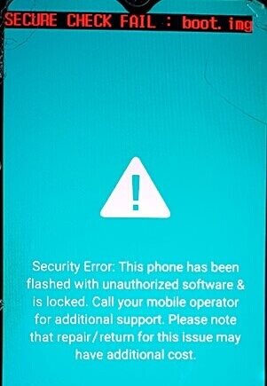

## Background
The Galaxy A20's bootloader has a bug where it refuses to load boot/recovery images that don't contain the `SignerVer02` magic and an AVB Footer at the end of the partition with the image's size. This results in the "SECURE CHECK FAIL" screen that we all know and love.

    

## How to fix
1. Download the Python script of this repository.
2. Run `python fix_bootable_image.py boot.img fixed.img` (replace boot.img with the boot or recovery image you want to fix)
3. Flash the `fixed.img` image through Heimdall
4. Done!